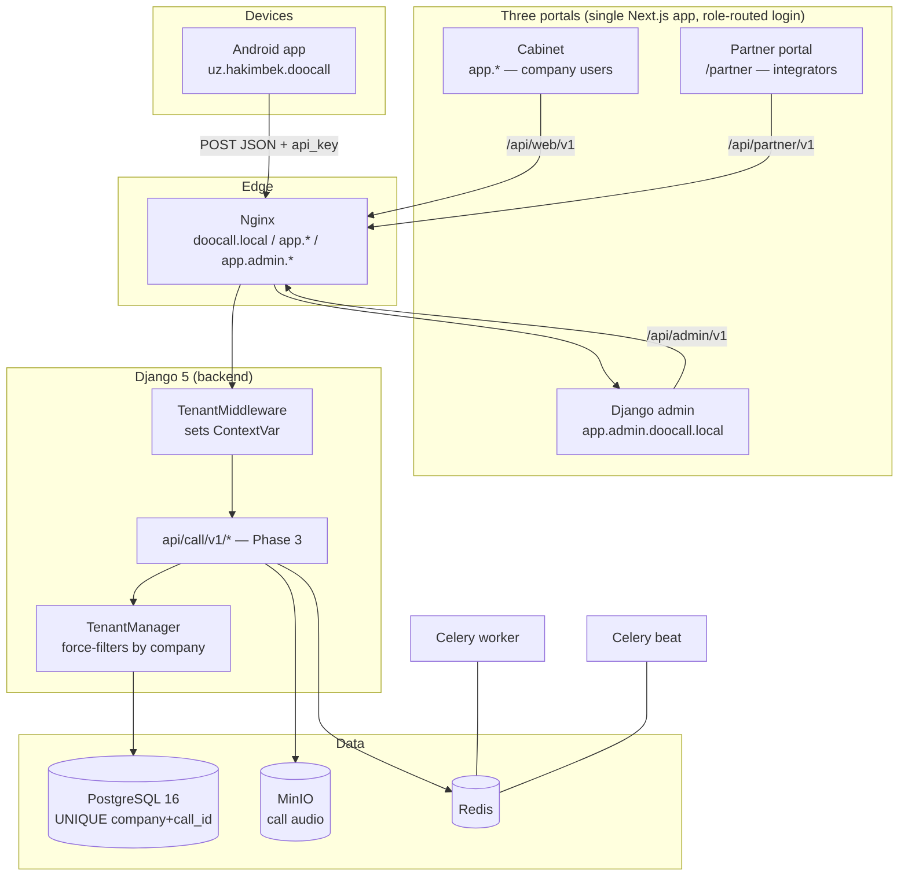

# dooCall — Architecture



## Multi-tenancy pattern

Tenancy is enforced in **one place** — the model manager — so no query
site can forget a `WHERE company_id = …`:

1. **Tenant root**: every tenant-owned table carries a `company` FK
   (`apps.core.tenancy.TenantModel`, abstract).
2. **Request-scoped context**: `TenantMiddleware`
   (`apps/core/middleware.py`) copies `request.user.company_id` into a
   `ContextVar` at the start of each request and clears it afterwards.
   `ContextVar` is async-safe: each request/task sees only its own value.
3. **Force-filtered manager**: `TenantManager` (the *default* manager of
   every `TenantModel`) appends `filter(company_id=<current>)` to every
   queryset whenever a context is active. App code simply writes
   `CallRecord.objects.filter(...)` and can never leak another tenant's rows.
4. **Explicit escape hatch**: `Model.all_objects` bypasses the filter.
   Using it is a visible, greppable decision — reserved for platform admin
   code, seeds and migrations.
5. **No context → unscoped**: management commands, Celery tasks without a
   tenant, and the Django admin (platform superusers, `company=None`) run
   without a context and see all rows. Tenant staff hitting the admin still
   get scoped automatically because the middleware sets their company.

Programmatic scoping (tests, Celery tasks acting for a tenant):

```python
from apps.core.tenancy import tenant_context

with tenant_context(company):
    CallRecord.objects.count()   # only this company's calls
```

### Why manager-level (not schema/database-per-tenant)?

* One schema keeps migrations trivial and cross-tenant platform reporting
  (billing!) cheap.
* The dedup contract (`UNIQUE (company, call_id)`) lives naturally in one
  table.
* Scale ceiling of a single Postgres comfortably covers the expected load
  (call metadata is small; audio lives in MinIO).

## Identity model (backend-api-docs.md §3)

| Concept | Model | Field |
|---|---|---|
| Web/dashboard login | `accounts.User` (AUTH_USER_MODEL) | `username` |
| Device-app login | `accounts.OperatorProfile` | `user_name` + `api_key` |
| Operator's real number(s) | `accounts.SimCard` | `(sim_slot, number)` |
| Counterparty identity | `calls.Contact` / `ContactPhone` | `resolved_name` on CDR |

## Phone normalization (contract §1)

`apps.core.phone.normalize_phone` is the single implementation used by the
API layer, seeds and admin: `+…` kept; 9 digits → `+998…`; 12 digits → `+…`;
anything else passes through untouched (the server never guesses).

## Billing chain

`PricingSetting` (global row, history-tracked) → `Subscription` (per company,
price snapshotted) → `Invoice` + `InvoiceLine` → `Payment`
(payme/click/manual; manual payments approved in the admin, audited via
`core.AuditLog`).


## Three-portal architecture (Addendum PART A)

One login (`/login`); the response's `portal` field routes to `/cabinet`,
`/admin` or `/partner` (`homeFor`). A `doocall_portal` cookie lets Next
middleware render a 403 page on wrong-portal navigation; real enforcement is
the API role guards (`IsPlatformStaff`, `IsSuperadmin`, `IsIntegrator`).
superadmin ⊃ platform_admin (settings, admin CRUD, overrides, payouts and
impersonation are superadmin-only). Integrators see ONLY commercial data —
no partner endpoint exposes calls/contacts/users/devices, and cabinet
endpoints 403 them (no company). The cashback engine accrues on every
successful payment (percent snapshot, months limit, refund reversal) and
funds the payout lifecycle (pending → approved → paid | rejected).


## Company subdomains (MoiZvonki-style, Phase 14)

Every company lives on **`<slug>.DOMAIN_ROOT`** (dev:
`ahlan-house.localhost`, prod: `deepvision.doocall.uz`):

* **nginx** — a wildcard `*.DOMAIN_ROOT` server proxies the cabinet UI,
  `/api/web/v1` and the mobile `/api/call/v1` on every company host.
  Prod needs a wildcard DNS record + wildcard TLS cert.
* **Landing login** — the header «Личный кабинет» dropdown signs in
  inline (the visitor stays on the landing), lists the account's
  companies via `GET /api/web/v1/auth/companies`, and each entry opens
  its own subdomain cabinet.
* **Session hand-off** — Chromium refuses to share cookies across bare
  `*.localhost`, so the landing→subdomain hop uses a **one-time 60-second
  code**: `POST /auth/handoff` (authenticated) mints it, the company link
  carries `?sso=<code>`, and the subdomain redeems it via
  `POST /auth/handoff/redeem` (single-use, cache-backed) into its own
  host cookie + access token. In production `COOKIE_DOMAIN=.doocall.uz`
  additionally shares the refresh cookie across subdomains; the cookie's
  `Domain` is only attached on product hosts (`cookie_domain_for`).
* **Host ↔ tenant guard** — on a company subdomain the cabinet API
  403s any JWT from another company, and the mobile API rejects an
  `api_key` whose company does not match the subdomain
  (`apps/core/domains.company_subdomain`). Neutral hosts (app domain,
  dev proxy) behave as before; the api_key/JWT remain the authority.
* **Mobile devices** point their `server` setting at the company's own
  subdomain: `https://<slug>.doocall.uz`.
